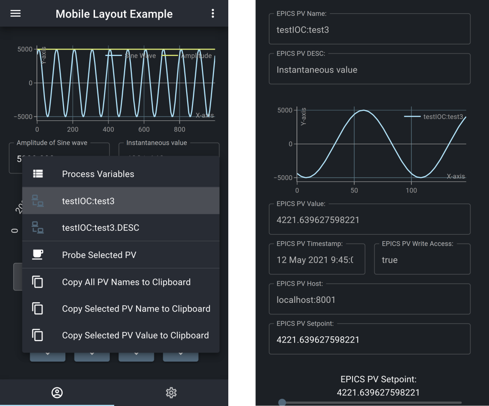

Current Release: V5.0.1

[Migrate from V4.0.3 to V5.0.X](docs/migrate-from-V4-to-V5.md)

# Introduction

React Automation Studio is a new software platform to enable the control of large scientific equipment through EPICS.

The system has been containerized with Docker and version controlled as a mono-repository using Git.


This repository is the master repository which  contains the code base and demos for each the component and interactive UI's that depend on the demo IOC micro service.


The repository can be checked out and the demos can be explored. Contributors can also add components and add in features. The master repository is available at:

**Master repository:**

https://github.com/React-Automation-Studio/React-Automation-Studio


If you wish to customize the project and create user interfaces for your EPICS control system then you should clone the boiler plate repository at which pulls in this code base as a Git submodule:

**Boiler plate repository:**

https://github.com/React-Automation-Studio/React-Automation-Studio-Example-Project-1

If you wish to create a standalone AlarmHandler project you should clone this project:

**AlarmHandler Boiler plate repository:**

https://github.com/React-Automation-Studio/React-Automation-Studio-Alarm-Handler-Standalone

**Or try it out on Codespaces (Experimental):**

[](https://codespaces.new/React-Automation-Studio/codespaces-demo?quickstart=1)


Each of the Docker containers are deployed as micro services and environment variables can be configured to deploy the system on different ports, or to enable user authentication and authorisation or to serve the application on a unique URL or on the localhost. Separate Docker commands exist to load the development and production version. These containerised environments allows for precise versioning of packages used and prevents deployment dependency issues.

The microservices that form part of React Automation Studio are shown in Fig. 1 and an overview of the system components are give below:


*Fig 1. The microservices that form part of React Automation Studio*

An overview of the system components are give below:

*1. pvServer*

This is the python process variable server. It is layered on the Flask and  Flask-Socket-IO web application frameworks to serve the EPICS process variables to clients.

Communication between clients and the pvServer occurs between the data connection wrapper in the client components and the pvServer as follows:

The client initially makes a Socket-IO connection to the pvServer. Depending if authentication is enabled the client will first be authenticated, thereafter the  data connection wrapper will emit Socket-IO events to the pvServer requesting access to the EPICS variable.

Depending on the clients access rights, access is either denied or the socket connection is placed in a Socket-IO room with read-only or read-write privileges but with same name as PV. EPICS CA to the required process variables are established and the PyEpics PV is stored in a list, the connection and value change call backs of the PyEpics CA are used to emit meta-data, connection status and value changes to the read-only and read-write rooms. The PV name is used as the event name.

In the data connection layer of the clients components, an event listener that is tied to the PV name is registered on the Socket-IO connection for each instantiation of the component. This allows efficient asynchronous update of each listening component when the pvServer emits the PVs event update.

The only difference between the read-only and read-write rooms is that the write-access field of the meta-data has been changed to read-only based on the access rights and that for a read-write room the write access field is inherited from security rights defined by the EPICS IOC or gateway.

Similarly for writes to an EPICS variable, depending on the access rights, the client is either granted  or denied permission to write to the variable.

*2. React frontend*

React was chosen to develop the frontend for the PWA as it enables us to develop the frontend in a single language, i.e JavaScript  as opposed to conventional web development in HTML, JavaScript and CSS. The UI interfaces that we have created are highly responsive and offer a real-time experience as is shown in the example of a mobile view in in Fig. 2.


*Fig 2. An example of a Mobile View.

We have integrated selected components from the Material-UI React component framework and the React-vis graphing framework with our system to create user interfaces with the same features that we use in our current CS-Studio operator interfaces. These components have been integrated with a data connection layer which handles, input and output, meta-data for labels, limits, precision, alarm sensitivity and initialization from the pvServer.

Some components can handle multiple PVs such as the graph or single PVs such as text inputs. For each of the components the PVs name can be declared using macros. The macros are replaced at component instantiation. This allows the  design of complex user interfaces that can be reused by simply grouping the components and changing the global macro to point to another system.





*Fig 3. An example of a context menu and a diagnostic probe user interface*

Many of the components such as TextInputs and TextOutputs have embedded diagnostic features such as a context menu and diagnostic probe as shown in figure 3.


*Fig 4. An example of a desktop beamline control system ui*

Apart form mobile UIs complex UIs suitable for desktop systems can also be created as is shown in figure 4.


*3. Styleguide*

A lot of effort was put into the documentation and a style guide based on React Styleguidedist and is used as the help function and to document the use of all the components from the source files. The current style guide is also  interactive with a demo IOC. All the properties of each of the components are documented and examples of their usage are shown.

*4. Access rights and Administration*

The URL, protocol selection for HTTPS or HTTP , authentication and server ports are controlled through the environment variables.

If React Automation Studio is installed on the localhost then there is no need to enable authentication as the host authentication system will protect access.

Since Release V3.0.0 React-Automation-Studio supports web based administration of user access rights. It also supports  external authentication through Active Directory and Google and local authentication. For the local authentication passwords are stored in the database using encrypted format using Bcrypt. The client is kept authenticated using an encrypted Jason Web Token (JWT) refresh and access tokens. When served over HTTPS, the refresh tokens are store in cookie with http only mode and the access tokens are kept in memory. This access token is used to check authorisation and access rights for every PV request and write. If the JWT is invalidated by the server then user will be required to login.

Access rights can be controlled though web based administrator which contains user access groups,roles and rules for defining PV access using regular expressions in the same way that the EPICS Gateway access is defined. All of the components in React Automation studio currently indicate access rights to the PV.

*5. MongoDB*

Since V2.0.0, React-Automation-Studio is integrated with MongoDB to store persistent data. The PyMongo driver is used within the pvServer to connect to a MongoDB replica set.

React hooks are available that setup a watch, perform an update or an insert to MongoDB replica set within the pvServer.

See the documentation in the style guide.

Currently the Alarm Handler component  and LoadSave component make use of the MongoDB database.

*6. AlarmHandler*

As of Release 3.0.0 the RAS AlarmHandler component is considered production ready.

The alarm handler is seeded through JSON files that populate the MongoDB alarm handler database. This database is also used to persist all alarm events and activity logs.

The alarm handler front end UI allows users to configure all aspects of the alarms and search through the entire alarm log. Alarm areas, subAreas and pvs can also be added/removed from the front end by alarmAdmin role users.

A user notification platform has also been created for the alarm handler. This platform allows a user to target specific pvs to be notified about using javascript regular expressions. At present users can be notified via email and Signal messenger. In future we hope to expand this to SMS and WhatsApp.

*7. Since Release 3.0.0, Nginx serves the static files for ReactApp and the styleguide, it also handles the transport layer security and performs load balancing. Scripts were created to dynamically configure Nginx based on the environment variables in Section 3.
For load balancing, Nginx balances between 3 pvServers in the production versions and 1 in the dev versions.

## YouTube Channel:
[](https://www.youtube.com/playlist?list=PL7x0LbUrw5BIgc2PUN3h1D0QRRqRuGzEO "React Automation Studio")

# 1 Installation
The development and production versions of React Automation Studio have been containerized with Docker.

It is advised to only use the containerized version with a Linux environment. (See the FAQ section on other operating systems).


Prerequisites: git, latest version of docker-ce and docker compose

( At the time of writing the system used Docker V25.0.2 and docker compose V2.24.5 )

To install docker-ce on Unbuntu follow:

https://docs.docker.com/engine/install/ubuntu/

It is advised to the follow the Post Installation steps for Linux:

https://docs.docker.com/engine/install/linux-postinstall/


1st clone this repo:

```bash
git clone https://github.com/React-Automation-Studio/React-Automation-Studio.git

```
or

```bash
git clone git@github.com:React-Automation-Studio/React-Automation-Studio.git
```

Then in React Automation Studio installation folder run:
```bash
touch .env
```
# 2 Launching the Docker compose files
The systems uses Docker to create isolated production and development environments. There are several docker-compose configuration files.


```bash
docker compose  up
```
or
```bash
docker compose -f docker-compose.yml up
```
Will launch the compiled production version with the demoIOC's and styleguide


```bash
docker compose -f docker-compose-dev.yml up
```
Will launch the development version with the demoIOC's and styleguide.


And:

```bash
docker compose -f docker-compose-dev-styleguide-dev.yml up
```
Will launch the development version of the styleguide.

**Note**: Any of the above containers can be rebuilt by add **--build** at the end of the command.


**Initially to check that everything is working only bring up the production version by running**

```bash
docker compose  up --build
```

This installation process of all the docker images may take a while  the first time. There after it is fast as all the repeated build and up commands uses cached installations. The longest process is the installation of the node modules. Do not be deterred by the red warnings.

This default installation will serve the  app at http://127.0.0.1:5000 and the style guide at http://127.0.0.1:6060.


To launch the development environment make sure the production version is stopped,and the run :
```bash
docker compose -f docker-compose-dev.yml up
```
This will launch the pvServer, demo IOC ,style guide and the React Development environment. As with the production version the first run may take awhile. There after it is fast as all the repeated build and up commands uses cached installations.

The react development environment app will be served on http://127.0.0.1:3000 and the styleguide at http://127.0.0.1:6060.

The source can then be edited using your favorite editor like Atom, when the file is saved the project automatically re-compiles and the web page is refreshed. It is recommended to only work in the
/src/components/staging/ folders.

Bug fixes and contributions can be submitted via pull requests.

To change the URL, ports, and enable user authentication See section 6.1 and 6.2


# 3 Enabling user login, authentication and https

If it is intended to run the application locally on a pc then no authentication is needed and the users' system login will protect access.

If access is required on a mobile device or from another pc then is encourage to enable HTTPS and user authentication.


To enable secure transmission of usernames and passwords it is highly recommend to enabled HTTPS as in section 3.3.

With this release the authentication  feature is quite open for customization. The authentication is handled in python backend and the authentication procedure can easily be modified to use another authentication procedure.

The current authentication method works as follows:

_Note: The administrator must first enable login ability and setup the users and access rights as described in 3.1._

The administrator page in 3.1 is used to create users or link with an external authenticator.


If the system is configured correctly then the user will be directed to the login page initially.

They will be prompted to enter the username and password or authenticate using the external authenticator.

The username and password or token is then  transmitted to the backend for authentication. If authenticated, the server returns  encrypted Jason web token (JWT) in the form on an access and refresh token. This is used to keep the user logged in between session. No username or password is stored in the browser. The user must logout in order cancel the session.


If the access token is invalid the user will be redirected to the login screen. The default access, and refresh token expiry is 300 seconds and 1 week. By default the access token and refresh tokens are refreshed once a minute.

All tokens of all users can also be invalidated by declaring a new secret key in the  environment variable: SECRET_PWD_KEY . If the SECRET_PWD_KEY  is not defined then a predefined key will be used .

For every process variable write the access rights are first checked to confirm if the process variable can be written to. And for every user at the initial data connection to each process variable the read access rights are checked.

If no read access rights are granted the widget on the client will display "connecting" permanently. And if no write access is granted the widget is indicated as read only.

## 3.1 Enabling https
The system is by default configured to serve the socket connections and client webserver over HTTP on localhost.

To enable secure login and installation as a PWA, a certificate and key needs to be installed that is bound to your hostname and the .env environment variables needs to be edited to serve overs HTTPS .

Inside the React Automation Studio installation folder:

```bash
ls .env
```
If it exists edit the .env file, otherwise copy example.env to .env and set

```bash

SERVER_PORT=5000
SECURE=true
HTTP_REDIRECT_TO_HTTPS=true

```
Alternately set SERVER_PORT to 443 which is the standard ssl port.

The certificates need to be placed in the the React Automation Studio installation folder under the certificates folder.

The certificate needs to be called: server.cer And the key needs to be called: server.key The .gitignore will prevent them from being copied to the repository

It is recommended to use a CA signed certificate, otherwise you can generate a self signed certificate using:

 openssl req -x509 -newkey rsa:4096 -sha256 -days 3650 -nodes -keyout server.key -out server.cer -subj "/CN=selfsigned" -addext "subjectAltName=DNS:localhost,IP:xxx.xxx.xxx.xxx"

In chrome you will need to add the certificate manually:
In Chrome go to
chrome://settings/security
Navigate to Manage certificates > Authorities and click on Import
Browse to where the self signed certificate and key and stored (certificates) and click OPEN
Ensure all Trust settings for the Certificate authority is ticked

The docker-compose  environment, will need to be restarted. Nginx will detect the change and serve the app over https.


The built client will be then served  https://(hostname or ip):SERVER_PORT/, the styleguide at https://(hostname or ip):6060/ and the dev client at https://(hostname or ip):3000


## 3.2 Enabling login and authentication

After enabling HTTPS

Set up the .env to enable login:
```bash
cd ..
ls .env
```
If the .env file exists in the root folder, then edit it and set :
```bash
VITE_EnableLogin=true
```
If the .env file does not exist in the root folder, then:
```bash
cp example.env .env
```
 then edit .env and set:
```bash
VITE_EnableLogin=true
```
Make sure that the other parameters in the file are correct. Or see 4.1:

The default username and password  will be admin / admin

The admin user will have full read and write access, whilst any other user will have read access by default.

To enable Active Directory Authentication open the .env and add, (You will need to rebuild the docker images):
```bash
VITE_EnableActiveDirectoryLogin=true
LDAP_HOST=ldap://xxxxxx
LDAP_PORT=389

```

To enable Active Directory Authentication open the .env and add, (You will need to rebuild the docker images):
```bash
Set VITE_EnableGoogleLogin=true
VITE_EnableGoogleLoginId= xxxxx
```
Set VITE_EnableGoogleLoginId to your google client id for your domain
at https://console.developers.google.com/apis/credentials/
click create new credentials and the create a new oAuth id  for the web app
It needs an https domain.
you can enter multiple domains:
for example: https://mydomain
https://mydomain:5000
https://mydomain:3000


It is envisioned that in the future more external authentication mechanisms will be added. In this case one may want to disable the standard authentication. This can be done by setting:

```bash
VITE_DisableStandardLogin=true
```
in the .env file.


## 3.3 Default user access rights

The access rights for each user are managed in the web administrator. If logged in as an admin role, the administrator link is via the more options in the right corner.

The default access rights are seeded only once by the adminDbInit mircoservice.

Regular expression rules are used to evaluate the read and write access rights.

The order in which the user access groups and rules are defined are important. The first rule applied is the DEFAULT, all user will get this. The final access group rules to be applied are the ADMIN rules to the applicable user groups.

For example in the default user access group, the rules disables write access and enable read access for all usernames and process variables:

The table display in the user interface allows one ot edit the access rights in the database and the DEFAULT UAG is shown in Fig 3.3.1


*Fig 3.3.1. The administrator access control page showing the default UAG*

To enable write access for everyone one could check the write access check boxes. To disable read access and therefore prevent access by anyone by default one could deselect the read checkboxes. The username set in DEFAULT UAG is '*' and by setting any of the UAG usernames to '*' implies that all users will get the rules defined in the UAG.
In the pvServer, the read and write access of the rules in the UAG are applied if the username is defined in the UAG and the following match function is satisfied:<br/><br/>
   match=re.search(rule,pv)
   <br/>
   <br/>
   If the match is true, then the rule is applied.
   <br/>

  <br/>
  In theory, all regular expression searches allowed by Python regex can be used although this has not been tested. More examples are available at:<br/>
  <br/>
https://www.w3schools.com/python/python_regex.asp


   <br/>
   <br/>
   In the two examples shown below in Fig 3.3.2 and 3.3.3, the ENGINEERS UAG, with roles as 'engineers' and user name user1 get read and write access to every pv, whilst the OPERATORS UAG, with roles as operators and username operator1 only gets read access for all pvs and write access for the two setpoint pvs.
   In this way the same user interface can be used for different roles and the operators will have different rights to the engineers.
   <br/>
   <br/>
   
   <br/>

   *Fig 3.3.2. An example UAG for Engineers*
  <br/>
   <br/>
  
   <br/>
   *Fig 3.3.3. An example UAG for Operators*

<br/>
<br/>
** New** to release 3.0.0 are the protected routes which uses the role and roles array prop to protect the route. This now enables portions of your app to isolated from other users.
<br/>
<br/>

## 3.4 Access and refresh tokens expiry

<br/>
<br/>
By default, unless a user logs out the refresh token will keep as user logged in for 1 week. And whilst the user is logged in the access tokens and refresh tokens are refreshed once a minute.
<br/>
<br/>
The token expiry is controlled by the following variables in the .env file.

<br/>
<br/>

| Variable Name |Default [s] | Description |
|-|-|-|
|REFRESH_COOKIE_MAX_AGE_SECS|604800|The refresh token will expire by default after 1 week.
|ACCESS_TOKEN_MAX_AGE_SECS|300|The access token will expire by default after 5 minutes.
|REFRESH_TIMEOUT|60|If the user is logged in then the refresh token and access token will be refresh by default once a minute.

<br/>
   <br/>

# 4 Folder structure
This section has some notes on  systems folder structure:

The installation folder is referenced below  as:
```bash
./
```
`./adminDbInit`contains the seed configuration for the administrator.

`./alarmHandlerDbInit`contains the seed configuration for demo alarm handler.

`./alarmHandlerServer`contains the source files for the Alarm Handler  server.

`./build` contains the static files for the web app and styleguide, once they are built.

Inside: `./certificates`the certificates according to 3.3 are placed.

Inside: `./docker`the docker files that build the containers that are used by the docker-compose files are placed.

Inside: `./epics`the demo  IOC that interacts with the Demo react screens is located.

`./loadSaveDbInit`contains the configuration for the load/save demo .

`./log`contains the log outputs from the pvServer.

`./mongoSetup`contains the source that sets up the mongoDb replica set.

`./nginx`contains the configuration files for nginx.

`./pvServer`contains the source files for EPICS process variable server.

`./ReactApp`contains the source files for the web app. They can be edited as is described in Section 2.

`./signalcli`contains the configuration files for signal.

`./utils` contains utilities used in different apps.

# 5 Running the web app as PWA

The automatic PWA installation notification is currently disabled. Installation can still occur manually.

On a mobile running Chrome, whilst viewing the website, click on the 3 dots at the top right and then click add to home. Follow the onscreen instructions to install.

On a desktop running Chrome, whilst viewing the website, click on the 3 dots at the top right and the click more tools and then create shortcut. Tick open as window and then create and the PWA will be installed on your desktop.

**Note**: Unless HTTPS is enabled then when viewing the PWA, a banner at the top stating that the webapp is insecure will appear,

# 6 Theme and color scheme
Refer to theme section in the style guide.

# 7 Contributing

Site specific components and app screens should be kept in your repository. If you wish to contribute to the main repository for bug fixes then this must be done in  the main repository at https://github.com/React-Automation-Studio/React-Automation-Studio. If you wish to add in new components then please create them in the staging folder. If the new component requires custom EPICS code then please add it to the demo IOC.

# 8 Contact

Contact us at Github Discussions: https://github.com/React-Automation-Studio/React-Automation-Studio/discussions

# Cite us

If you use React Automation Studio in your research, please cite us as follows:

```
@inproceedings{duckitt:icalepcs2023-fr2bco01,
  author       = {W. Duckitt and J.K. Abraham and D. Marcato and G. Savarese},
  title        = {{React Automation Studio: Modern Scientific Control with the Web}},
% booktitle    = {Proc. ICALEPCS'23},
  booktitle    = {Proc. 19th Int. Conf. Accel. Large Exp. Phys. Control Syst. (ICALEPCS'23)},
  eventdate    = {2023-10-09/2023-10-13},
  pages        = {1643--1649},
  paper        = {FR2BCO01},
  language     = {english},
  keywords     = {EPICS, controls, interface, GUI, framework},
  venue        = {Cape Town, South Africa},
  series       = {International Conference on Accelerator and Large Experimental Physics Control Systems},
  number       = {19},
  publisher    = {JACoW Publishing, Geneva, Switzerland},
  month        = {01},
  year         = {2024},
  issn         = {2226-0358},
  isbn         = {978-3-95450-238-7},
  doi          = {10.18429/JACoW-ICALEPCS2023-FR2BCO01},
  url          = {https://jacow.org/icalepcs2023/papers/fr2bco01.pdf},
  abstract     = {{React Automation Studio is a progressive web application framework that enables the control of large scientific equipment through EPICS from any smart device connected to a network. With built-in advanced features such as reusable widgets and components, macro substitution, OAuth 2.0 authentication, access rights administration, alarm-handing with notifications, diagnostic probes and archived data viewing, it allows one to build modern, secure and fully responsive control user interfaces and overview screens for the desktop, web browser, TV, mobile and tablet devices. A general overview of React Automation Studio and its features as well as the system architecture, implementation, community involvement and future plans for the system is presented. }},
}
```
or: https://doi.org/10.18429/JACoW-ICALEPCS2023-FR2BCO01

 and:

 ```
 @InProceedings{duckitt:cyclotrons2019-tha03,
  author       = {W. Duckitt and J.K. Abraham},
  title        = {{React Automation Studio: A New Face to Control Large  Scientific Equipment}},
  booktitle    = {Proc. Cyclotrons'19},
  pages        = {285--288},
  paper        = {THA03},
  language     = {english},
  keywords     = {EPICS, controls, GUI, interface, cyclotron},
  venue        = {Cape Town, South Africa},
  series       = {International Conference on Cyclotrons and their Applications},
  number       = {22},
  publisher    = {JACoW Publishing, Geneva, Switzerland},
  month        = {jun},
  year         = {2020},
  isbn         = {978-3-95450-205-9},
  doi          = {10.18429/JACoW-Cyclotrons2019-THA03},
  url          = {http://jacow.org/cyclotrons2019/papers/tha03.pdf},
  note         = {https://doi.org/10.18429/JACoW-Cyclotrons2019-THA03},
}
 ```
 or: https://doi.org/10.18429/JACoW-Cyclotrons2019-THA03


# FAQ

### 1.   Which operating systems are supported?

  The client is web based and can be accessed from any modern browser on any modern OS..

  We currently only build and test on Ubuntu and Chrome. We unfortunately don't have the time to test on the other systems. In theory all up to date Linux systems should be supported.

### 2.  Are other systems such as  Windows or Mac OS supported?

  The docker containers for RAS run in network  mode host. This is done to enable EPICS to communicate seamlessly with any IOC's on the same subnet as the host. Other OSes such as Windows may not support the host mode and will run in the bridged mode. This may break the communication between the micro services. It is therefore recommended to run the RAS containers on a Linux VM that is minimally running Ubuntu Server. Please ensure the the VM network interface is assigned an IP on the same subnet as your EPICS network in order for communication with the IOC's to occur seamlessly.


# Changelog
  V5.0.1 Friday 08 March 2024 Minor Updates:
  <ul>
    <li>Package updates to Backend modules</li>
    <li>Updated to Epics 7.0.8 and Python 3.12.1</li>
    <li>Package updates to all Node modules</li>
    <li>Updated to the latest Node LTS</li>
    <li>Minor Bug fix to EPICS socketIO connections, PR#128</li>
  </ul>
  <br />
  V5.0.0 Friday 02 February 2024 Major Updates:
  <ul>
    <li>Package updates to Backend modules</li>
    <li>Updated to Epics 7 and Python 3.12.1</li>
    <li>Moved from Create-react-app to Vite</li>
    <li>Package updates to all Node modules</li>
    <li>Updated to the latest Node LTS</li>
    <li>MUI has been updated to the latest packages</li>

  </ul>
  New Features:
  <ul>
    <li>
      Docker multi-stage builds for speed improvements
    </li>
    <li>
      Preview of an AreaDector Appliance user interface with included simulation
    </li>
    <li>
      Named MongoDb volumes for easier management
    </li>
  </ul>
  Breaking Changes:
  <ul>
    <li>
      See the migration guide to migrate from V4.0.3 to V5.0.0
    </li>
  </ul>

 [Migrate from V4.0.3 to V5.0.0](docs/migrate-from-V4-to-V5.md)

  <br />
V4.0.3 Friday 20 October 2023 Minor Updates:
<ul>
  <li>Package updates to all Node modules</li>
  <li>Updated to the latest Node LTS</li>
  <li>MUI has been updated to the latest packages</li>
  <li>Package updates to pVServer Python packages</li>
</ul>
Minor Bug Fixes and Updates:
<ul>
  <li>
    Fixed pvServer Flask, Werkzeug dependencies.
  </li>
</ul>

<br />


V4.0.2 Thursday 13 July 2023 Minor Updates:
<ul>
  <li>Package updates to all Node modules</li>
  <li>Updated to the latest Node LTS</li>
  <li>MUI has been updated to the latest packages</li>

</ul>
Minor Bug Fixes and Updates:
<ul>
  <li>
    A few minor bug fixes to the pvServer
  </li>
</ul>

<br />

V4.0.1 Friday 24 March 2023 Minor Updates:

<ul>
  <li>Package updates to all Node modules</li>
  <li>Updated to the latest Node LTS</li>
  <li>MUI has been updated to the latest packages</li>
  <li>Changed the contact information to Github Discussions: https://github.com/React-Automation-Studio/React-Automation-Studio/discussions</li>

</ul>
Minor Bug Fixes and Updates:
<ul>
  <li>A few minor bug fixes to the slider and the context menu</li>

</ul>
Minor Breaking Changes:
<ul>
  <li>Previous version of google sign in is being deprecated (see https://developers.googleblog.com/2021/08/gsi-jsweb-deprecation.html )Solution is to replace "react-google-login" with @react-oauth/google</li>

</ul>
<br />

V4.0.0 Wednesday 3 August 2022

Major Updates:
<ul>
  <li>Update to React 18.2.0 </li>
  <li>Update to MUI 5.9.2,  see the section on breaking changes below</li>
  <li>All NodeJs packages have been updated to latest versions except react-router-dom.</li>
  <li>ReactVis was dropped and components have been updated to use Plotly.js </li>
</ul>

Minor Bug Fixes and Updates:
<ul>
  <li>Minor formatting and theme changes due  MUI update</li>
  <li>General clean up of code formatting in both pvServer and React (prior upgrading the MUI library)</li>
  <li>Addition of Poetry as Python package manager</li>
  <li>Addition of Black as a formating tool for Python. A merge request will fail if Python is not formatted accordingly. The tool Black is included into development section of Poetry.</li>
  <li>Restoration of GitHub pages build. The build excludes style guide documents because they include
    double braces ({) in examples which are treated as an output markup by Liquid.
  </li>
  <li>Minor documentation clean up: links to repositories/ projects up to date.</li>
</ul>

Breaking Changes:
<ul>
  <li>ReactVis was dropped</li>
  <li>Update to MUI 5.9.2 from Material UI 4<br/>
  Follow the migration guide at: https://mui.com/material-ui/migration/migration-v4/
  and apply the preset-safe code mods https://mui.com/material-ui/migration/migration-v4/#preset-safe
  </li>
  <li>
    If you customized any of the themes be sure to update it in line with the base themes  that come with the master repo
  </li>
  <li>Removed Deprecated ActionFanoutButton - use ActionButton instead</li>
  <li>Removed Deprecated SwitchComponent - use Switch instead</li>
  <li>Removed Deprecated SimpleSlider - use Slider instead</li>
</ul>


V3.1.0 Wednesday 25 August 2021
<br />
<br />
Minor Bug Fixes and Updates:
    <ul>
        <li>Hot fix in NodeJs Docker files for new npm registry requirements, previous releases will fail after 1 October 2021 </li>
    </ul>
<br />


V3.0.2 Monday 23 August 2021
<br />
<br />
Minor Bug Fixes and Updates:
    <ul>
        <li>pvServer: minor bug fix</li>
        <li>StyledIconIndicator: non zero values default to onColor</li>
        <li>Docker: standardised to Python 3.8.7 in all Python images</li>
    </ul>
<br />


V3.0.1 Monday 28 June 2021
<br />
<br />
Minor Bug Fixes and Updates:
    <ul>
        <li>GraphY: Fixed timestamp issue</li>
        <li>Alarmhandler:  Minor bug fixes- Implemented non blocking queue to improve Signal notification throughput</li>
        <li>Nginx: Fixed a waring on a script</li>
        <li>pvServer: minor bug fix</li>
    </ul>


<br />


V3.0.0 Monday 24 May 2021
<br />
<br />
Improvements and new features:
  <br />
  <ul>
    <li>New web based administration</li>
    <li>Nginx now serves the static files, performs the transport layer security and load balancing</li>
    <li>AlarmHandler now supports Signal notifications, improvements to the user interface</li>
    <li>Simplification of environment variables</li>
    <li>Improvement of security features, with move from Access tokens, to short lived Access tokens with Refresh tokens</li>
    <li>External Authentication via Active Directory or Google Authentication</li>
    <li>Removal of the requirement for the prefix for EPICS process variables</li>
    <li>Improvement of the MongoDb hooks</li>
    <li>Component updates:
    <ul>
        <li>GraphY is now based on Plotly</li>
        <li>GraphXY is now based on Plotly</li>
    </ul>
    </li>
    <li>Package updates</li>
    <li>Minor Bug Fixes</li>

  </ul>
Breaking changes:
<ul>
    <li>Removal of the old file based administration</li>
    <li>Environment variable names have been simplified</li>
    <li>GraphY and GraphXY background now defaults to the theme.palette.background.default value</li>

</ul>


<br />

V2.2.0 Wednesday 20 January 2021
<br />
Improvements and new features:
  <br />
  <ul>
    <li>AlarmHandler now supports email notifications</li>
    <li>New Components:
    <ul>
        <li>New ArrayContainer</li>
        <li>New LightPanel</li>
    </ul>
    <li>Upgraded to Socket.IO 3.1.0</li>
    <li>Upgraded pvServer to Flask-SocketIO 5.0.1</li>
    <li>Package updates</li>
    <li>Minor Bug Fixes</li>
    </li>
  </ul>


 V2.1.0 Tuesday 20 October 2020
<br />
  Improvements and new features:
<br />
<ul>
  <li>Added Epics Archiver Viewer component</li>
  <li>Package updates</li>
</ul>


V2.0.1 Tuesday 29 September 2020
  <br />
  Improvements and new features:
  <br />
  <ul>
    <li>Added logging to pvServer</li>
    <li>Minor bug fix to pvServer</li>
  </ul>

V2.0.0 Wednesday 5 August 2020
<br />

Improvements and new features:
<br />
<ul>
  <li>Updated to React Hooks based  components</li>
  <li>Introduction of new RasAppCore component, the logic in App.js is replaced by this component</li>
  <li>Created the new component Widget that is the base component for all Widgets.</li>
  <li>PV component substitutes old DataConnection component.</li>
  <li>Dynamic connection: When useMetadata props is false some fields, such as min, max, prec, alarm and units, are read from external PVs or an additional connection with those fields is established. By default useMetadata prop is false.</li>
  <li>New Layout with new themes.</li>
  <li>All buttons can receive and icon.</li>
  <li>All components extending MUI components can pass MUI props to the MUI components through a special prop (it changes based on the component).</li>
  <li>All components can have a tooltip.</li>
  <li>Widget base components now accept macros in the label and units</li>
  <li>Integration with MongoDb database with the addition of Mongodb hooks to setup a watch, and perform an update and insert a MongoDb document.</li>
  <li>Update of all demos to Hooks based components</li>
  <li>Update of all beam line components to Hooks based components, with new documentation</li>
  <li>Create new experimental sections to hose previews of new components</li>
  <li>Preview Components
    <ul>
      <li>
        Preview release of the Alarm Handler server and client UI
      </li>
      <li>
        Preview release of the Load/Save client UI
      </li>
    </ul>
  </li>


  <li> Deprecated Components: These components will be removed in future releases                  <br />
    <ul>
      <li>
        SimpleSlider -> Use Slider
      </li>
      <li>
        ActionFanoutButton -> Use ActionButton
      </li>
      <li>
        SwitchComponent -> Use Switch
      </li>
      </ul>
  </li>
  <li>
    Removed Component:

  <ul>
    <li>
      GraphMultiplePVs
    </li>
  </ul>
  </li>
  <li>
    Breaking Changes:

  <ul>
    <li>
    routes.js was renamed Routes.js and now contains extra logic to enable dynamic or isolated routes based on the use role.
    </li>
    <li>
    If you added extra logic to the App.js you will to adapt to the new RasAppCore component.
    </li>
  </ul>
  </li>
  <li>Packages updated in both RAS and RAS-Example-Project-1</li>

</ul>

**V1.2.4 Thursday 2 April 2020**

Minor bug fixed in the styleguide for GraphY and GraphXY
Updated to React-style-guidist 11.0.4

**V1.2.3 Wednesday 11 March 2020**
Node 12.16.1 LTS
Material UI 4.9.5
React-style-guidist 11.0.1
Fixed height props and added in an aspect ratio in the progress bar and tank components
**V1.2.1 Monday 17 February 2020**
Minor updates

Updated to React-Scripts 3.4.0

**V1.2.0 Tuesday 11 February 2020**
Major updates

Updated to React 16.12.0
Updated to Material-UI 4.9.2
Updated to Node LTS 12.15.0

Changed the version of Python in pvServer to 3.7.5 from 3.7


**V1.1.0 Thursday 28 November 2019**
Note: The compile of PyEpics breaks with the latest version of the Python 3.7 docker image and appears to be an issue in Python 3.7.6.
Either fix the dockerfile to version 3.7.5 or move to React Automation Studio V1.2.0 -11 February 2020


Changed disconnection indicators for all components

Components added:
BitIndicators
GraphXY
GraphY

Components to be deprecated in future:
GraphMultiplePVs, replacement is GraphY

Major package updates:

Updated to React 16.11.0
Updated to Material-UI 4.7.0
Updated to Node LTS 12.13.1

**V1.01 Friday 25 October 2019**

Minor bug fix to Selection List and Radio Button Group components

Updates to documentation, explanations of initial local variable value properties that were missing from some components.

**V1.00 Monday 21 October 2019**
Initial Public Release
