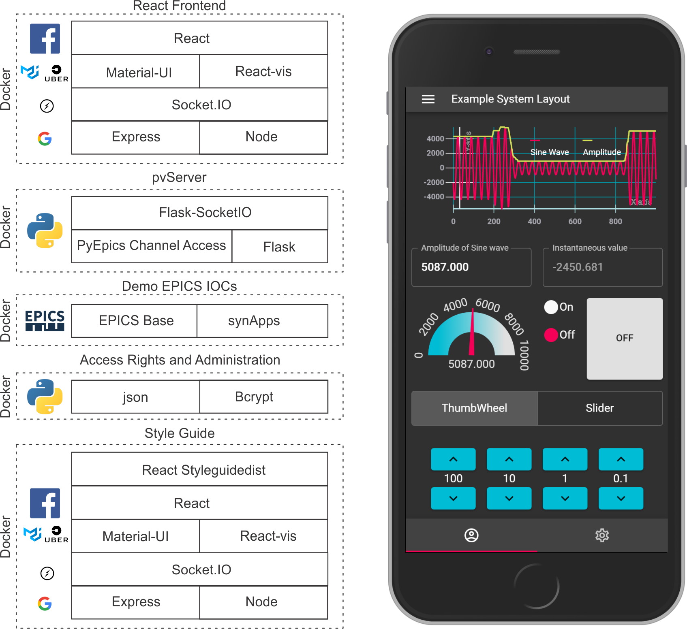

#Introduction

Automation Studio is a new software platform to enable the control of large scientific equipment through EPICS.

The system implements a modern tool chain with a React frontend with integrated Material-UI and ReactVis components and real time Socket-IO data transfer to a Python based PyEpics backend.
Installation occurs as a progressive web application. This enables efficient and responsive cross platform and cross device operation.

The current software stack is show in Fig1.


*Fig 1. The current software stack*

This repository is the code source for Automation Studio. The repository is built in 4 components:

*1. pvServer*

This is the python process variable server. Process variable requests are made from the multiple connected clients, the pvServer makes a connection to the EPICS process variable and serves the process variable meta data and data to client through socket-IO events.

User login and authentication can enable in the pvServer and the client by altering the environment variables.

*2. React frontend*

 The React frontend is  integrated with Material-UI and ReactVis components that have data a connection wrapper around them that allow connection to the pvServer through a single socket.

 Some components can handle multiple PVs such as the graph or single PVs such as textinputs. For each of the components the PVs name can me declared using macros. The macros are replaced at runtime.
 This allows  the complex design of user interfaces that can be reused by simply grouping the components and changing the global macro to point to another system.

 By using Material-UI's grid layout system responsive UI's can be implemented  across platforms and across multiple devices.

 Enormous effort was put into the documentation and the style guide should be launched to view how to use and instantiate the components.


*3. Styleguide*

The style guide is based on Reactstyleguidedist and is used to document the use of all the components from the source files. The current style guide is interactive with the demo IOC

*4. Demo Epics IOC*

The repository comes with a demonstration IOC that enables the frontend demos to connect live to a realtime system.

*5. Future*

In future boiler plate repositories will be created that pull in the packages from this repository and the installation will be simplified through the use of containers.


# 0 Automated installation of Automation Studio

1st clone the repo


2nd setup enviroment variables as in 7.1 and 7.2

In Automation Studio installation folder
```bash
npm install
npm run build
npm run styleguidebuild
docker-compose up
```


# 1 Semi Automated installation of Automation Studio

This is still in testing mode. use manual installation for now

1st clone the repo

## 1.1 Install npm modules

In Automation Studio installation folder
```bash
npm install
npm run build
```

## 1.2 pvServer Installation

Make sure docker is installed:

https://www.digitalocean.com/community/tutorials/how-to-install-and-use-docker-on-ubuntu-18-04

In Automation Studio installation folder:
To build:

```bash
  docker build -t pvserver -f docker/pvserver/Dockerfile .
```

To run:

```bash

  docker run -d -P --network="host"  pvserver
```


## 1.3 demoIOC Installation

Make sure docker is installed:

https://www.digitalocean.com/community/tutorials/how-to-install-and-use-docker-on-ubuntu-18-04

In Automation Studio installation folder:
To build:

```bash
   docker build -t demoioc -f docker/demoioc/Dockerfile .
```

To run in detached mode :

```bash

  docker run -it -d -P --network="host"  demoioc
```

Or in foreground:

```bash

  docker run -it  -P --network="host"  demoioc

```


## 1.4 production frontend Installation

Make sure docker is installed:

https://www.digitalocean.com/community/tutorials/how-to-install-and-use-docker-on-ubuntu-18-04

In Automation Studio installation folder:
To build:

```bash
   docker build -t frontendserver -f docker/frontendserver/Dockerfile .
```

To run:

```bash

   docker run -d -P --network="host"  frontendserver
```


## 1.5 production Styleguide Installation

Make sure docker is installed:

https://www.digitalocean.com/community/tutorials/how-to-install-and-use-docker-on-ubuntu-18-04

In Automation Studio installation folder:
To build:

```bash
   docker build -t styleguideserver -f docker/styleguideserver/Dockerfile .
```

To run:

```bash

   docker run -d -P --network="host"  styleguideserver
```


Still to come...

# 2 Automated Dev environment

Still to come...

# 3 Automated Production deployment

Still to come...

# 4 Manual Installation

Clone this repo.

##4.1 Manual Installation of EPICS

The system comes with an EPICS demo IOC which runs on a custom port 8001, so as not to interfere with the normal EPICS network,

If the demo IOC is not required then at least EPICS base installation needs to exits for PyEPICs to enable the channel access.

If you wish to customize the location of EPICS installation then the following lines need to be edited to pointed to your install location, otherwise add as so to the end of your to your **~/.bashrc**

### 4.1.1 Setup the EPICS environment variables

```bash

export PYEPICS_LIBCA=/epics/base/lib/linux-x86_64/libca.so
export EPICS_BASE=/epics/base/
export EPICS_HOST_ARCH=x86_64

```

To enable pyEpics to communicate to the demo IOC also add

```bash

export EPICS_CA_ADDR_LIST="127.0.0.1:8001"

```

The default is to place the EPICS installation inside the epics subfolder for the installation folder Automation Studio's.

It is also necessary then to create a symbolic link to /epics , otherwise the configure RELEASE files need to be updated manualy

### 4.2.2.1 Install dependencies

Run:

```bash
sudo apt-get install autoconf libtool check patch build-essential libreadline-gplv2-dev re2c libxml2-dev  tmux curl
```

### 4.2.2.2 Download and install EPICS base

Inside the epics subfolder, run:  

```bash
ls
```  

You should see the testIOC folder which houses the demo IOC.

Next, download and install base  

Run:  

``` bash  
wget https://epics.anl.gov/download/base/base-3.15.6.tar.gz
tar -xvf base-3.15.6.tar.gz
mv base-3.15.6 base
cd base
make
cd ..
rm base-3.15.6.tar.gz
sudo ln -s $PWD/epics /epics
cd /epics
ls
```
check to see if your epics files exist

cd back to Automation Studio install path and cd to epics/


### 4.2.2.3 Download and install Synapps

If you are installing the demo IOC the n you must install Synapps

Run:  

```bash

wget https://epics.anl.gov/bcda/synApps/tar/synApps_6_0.tar.gz
tar -xvf synApps_6_0.tar.gz
mv synApps/support/ support
rm -R synApps
rm synApps_6_0.tar.gz

```
Edit support/configure/RELEASE to suite your needs or run:

```bash
cp config/synApps_6_0/configure/RELEASE support/configure/RELEASE
cp config/synApps_6_0/busy-R1-7/configure/RELEASE support/busy-R1-7/configure/RELEASE
cp config/synApps_6_0/ipac-2-15/configure/RELEASE support/ipac-2-15/configure/RELEASE
cd support
make release
make
cd..
cd testIOC
make clean
make
```


---

## 4.2 Install node V10.15.0
```bash
 curl -o- https://raw.githubusercontent.com/nvm-sh/nvm/v0.34.0/install.sh | bash
 source ~/.bashrc
 nvm install v10.15.0
 nvm ls
 node --version
```

## 4.3 Install reactJS node modules

cd to automation studio install directory

```bash

npm install

```

This may take a while depending on you internet connection speed


## 4.4 Install Python 3.7.3

Install dependencies:

```bash
sudo apt-get install -y make build-essential libssl-dev zlib1g-dev libbz2-dev \
libreadline-dev libsqlite3-dev wget curl llvm libncurses5-dev libncursesw5-dev \
xz-utils tk-dev libffi-dev liblzma-dev python-openssl git
```
Install pyenv:
```bash

curl -L https://github.com/pyenv/pyenv-installer/raw/master/bin/pyenv-installer | bash

```

Then Add the following to ~/.bash_profile, ~/.profile or ~/.bashrc.

```bash
export PATH="$HOME/.pyenv/bin:$PATH"
eval "$(pyenv init -)"
eval "$(pyenv virtualenv-init -)"

```

then:

```bash

source ~/.bashrc


pyenv update

pyenv install 3.7.3

pyenv versions

pyenv virtualenv 3.7.3 venv

pyenv activate venv

cd pvServer

pip3 install -r requirements.txt

```

On beagle bone with debian jessie, need to install a newer openssl:

https://help.dreamhost.com/hc/en-us/articles/360001435926-Installing-OpenSSL-locally-under-your-username


# 5 Manual Dev environment

Open up the terminal.

cd to automation studio install location.

## 5.1 Launch the pvServer

Initially:
```bash
cd pvServer
pyenv activate venv
```
Then
```bash
python3 pvServer
```
## 5.2 Launch the demo IOC

In a new terminal:

cd to automation studio install location

```bash

cd epics/testIOC/iocBoot/ioctestIOC/
./st.cmd
```

## 5.3 Launch the dev ReactJS Environment

In a new terminal:

cd to automation studio install location

```bash
npm start
```

open at http://locahost:3000


## 5.4 Optionally launch the dev styleguide

In a new terminal:

cd to automation studio install location

```bash
npm run styleguide
```

open at http://locahost:6060

Note: if login ability has been enable as in 7.1, then the styleguide cannot connect to demoIOC.
A work around will exist in future.


## 5.5 Or launch the production styleguide

In a new terminal:

cd to automation studio install location

```bash
npm run styleguidebuild
node styleguideServer.js
```

open at http://locahost:6060

Note: if login ability has been enable as in 7.1, then the styleguide cannot connect to demoIOC.
A work around will exist in future.


# 6 Manual Production deployment
6.1,6.2 and 6.5 are the same as 5.1,5.2 and 5.5 except for 5.3.and 5.4

## 6.3 Launch the dev ReactJS Environment

In a new terminal:

cd to automation studio install location

```bash
npm run build
```
The build is currently served via the flask server at:
open at http://locahost:5000 or replace localhost with host's hostname or ip  

Or run a node express server:

```bash
node clientserver.js
```

Open at http://locahost:9000 or replace localhost with host's hostname or ip

Currently the node express is the preferred installation as the PWA installs correctly.


#7 Enabling user login, authentication and https

The system has ability to enable regular user authentication and login ability.
With this release the login authorisation feature is quite open for customization. The authorisation is handled in python backend and the authorisation procedure can easliy be modifed to use another authisation procedure.

The login procedure is as follows: Fisrtly the username and password needs to manuallly declared in the  pvServer/userAuthentication/USERS file. Then from the login page the user enters the email and password on the client and then the authorisation procedure compares the login details with that declared in the pvServer/userAuthentication/USERS file.
If authorisation is confirmed then the an encrypted JWT token is returned, which will keep the user logged in until they log out or the server invalidates the JWT. In this case the user will redirected to the login page

##7.1 Enabling login and authentication

First cd to Automation Studio installation directory

```bash
cd pvServer/userAuthentication/
cp USERS.example  USERS
```
Then edit the  USERS file to add in  your user profile

The format  per line is:

Userid:email:pw

Next set up the .env to enable login:
```bash
cd ..
ls .env
```
If the .env file exists in the root folder, then edit it and set :
```bash
REACT_APP_EnableLogin=true
```
If the .env file does not exist in the root folder, then:
```bash
cp example.env .env
```
 then edit .env and set:
```bash
REACT_APP_EnableLogin=true
```
Make sure that the other parameters in the file are correct. Or see 7.2:


##7.2 Enabling https
Firstly the system is by default configured to serve the socket connections and client webserver over http on locahost or on the hostanmes ip.

To enable secure login and installation as a PWA, a certificate and key needs to be installed that is bound to your hostname and the .env environment variables need to be edited to serve overs https and via the correct hostname.

Inside the Automation Studio installation folder:

```bash
ls .env
```
If it exist edit .env file otherwise copy example.env to .env and set

```bash

REACT_APP_PyEpicsServerURL= https://example.com:5000/test
```
to https and the correct hostname

Then set :
```bash

REACT_APP_AutomationStudioStyleGuideBuildURL=https://example.com:6060
```

The certificates neeed to be placed in the the Automation Studio installation folder.

The certificate needs to be called: server.cer
And the key needs to be called: server.key


The pvServer and node development environment, will need to be restarted, and the production environments will need to be rebuilt.

Both the pvServer and the node clientserver will automatically detect the change.

The built client will be then served https://example.com:5000/ or https://example.com:9000/ and the dev client at https://example.com:3000/
